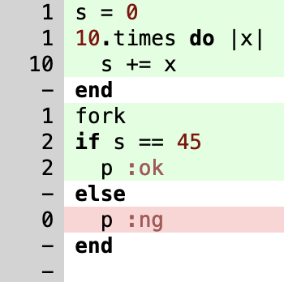

= cover_rage

image::https://github.com/tonytonyjan/cover_rage/actions/workflows/test.yml/badge.svg[test]

cover_rage is a Ruby code coverage tool designed to be simple and easy to use. It can be used not only for test coverage but also in production services to identify unused code.

Key features:

. Runs in continuous processes (e.g., Rails servers)
. Zero dependencies
. Supports forking and daemonization without additional setup

== Installation

[source,shell]
----
gem install cover_rage
----

== Setup

[source,ruby]
----
require 'cover_rage'
----

*AND THAT'S IT!*

No rack middleware, no fork callbacks, no configuration files, and no additional setup required.

It starts collecting coverage data and periodically writes to `./cover_rage.pstore`.

To change the store type and location, refer to `COVER_RAGE_STORE_URL` below.

To export results to HTML later, run `cover_rage`.

== Quick Start

[source,shell]
----
cat >main.rb <<RUBY
s = 0
10.times do |x|
  s += x
end
fork
if s == 45
  p :ok
else
  p :ng
end
RUBY

gem install cover_rage
ruby -r cover_rage main.rb
cover_rage > cover_rage.html
----

== Integration with Ruby on Rails

No additional setup is required because Rails loads gems automatically, but you can customize the behavior by updating `Gemfile`.

To run cover_rage only in the test environment:

.Gemfile
[source,ruby]
----
gem 'cover_rage', group: :test
----

To manually start cover_rage:

.Gemfile
[source,ruby]
----
gem 'cover_rage', require: false
----

.config/boot.rb
[source,ruby]
----
require 'cover_rage'
----

== Exporting Results

[source,shell]
----
cover_rage --format html
----

Run `cover_rage -h` for more information.

== Environment Variables

. `COVER_RAGE_STORE_URL`
+
Available URL schemes:
+
--
.. `pstore://ABSOLUTE_PATH_TO_PSTORE_FILE`
.. `redis://REDIS_HOST`
.. `sqlite://ABSOLUTE_PATH_TO_SQLITE_DB_FILE`
--
+
Ensure you have the necessary gems (e.g., `sqlite3`, `redis`) installed to use other store types.
+
Defaults to `pstore:$(pwd)/cover_rage.pstore`.

. `COVER_RAGE_INTERVAL`
+
It sets The interval in seconds between each write to the store.
+
Defaults to `60`.

. `COVER_RAGE_PATH_PREFIX`
+
cover_rage will only record files that match the specified prefix.
+
Defaults to `Rails.root` if the `Rails` constant is defined; otherwise, defaults to `Dir.pwd`.
